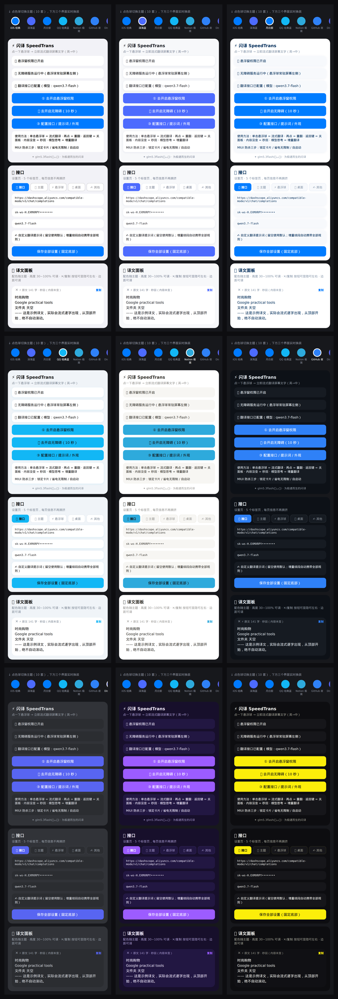

# ⚡ 闪译 SpeedTrans

一键流式屏幕翻译：**点一下悬浮球，当前屏幕英文立即流式翻译成中文**。

## 🎨 主题图书馆（9 套经典配色）



*浅色系：iOS 经典 / DeepSeek 深海蓝 / Kimi 月白紫 / QQ 经典蓝 / Notion 极简 · 暗色系：GitHub 夜 / Discord 夜 / 赛博 2077 / 紫电夜。主界面顶部色球条一键换装，设置 → 🎨 主题 可看全套。*

设计目标只有一个字：**快**。

- 取词不走截图/OCR，直接从系统无障碍节点树读文字（约 0.1~0.5 秒）
- 翻译走 OpenAI 兼容流式接口（千问 / DeepSeek / 任意兼容服务商），首个译文 1 秒内上屏
- 译文悬浮窗**常驻**，不随原文滚动消失；翻译中再点球 = 忽略（一次只跑第一次的反应）
- **增量翻译**：模型思考类持续增长的内容，再点球只翻译新增部分，译文自动续写
- 相同内容点球 = 秒回（0 请求）
- 单文件级实现，无第三方 SDK 依赖（仅 OkHttp + AppCompat）

## 构建（GitHub Actions 云端出 APK，无需电脑）

1. 把本目录所有文件（保持目录结构，含 `.github/`）上传到一个 GitHub 仓库
   （手机浏览器桌面模式：New repository → uploading an existing file → 拖入全部文件）
2. 打开仓库 **Actions** 标签页 → 选 **Build APK** → **Run workflow**
3. 等 3~5 分钟，进入该次运行 → **Artifacts** → 下载 `SpeedTrans-debug-apk`
4. 解压得到 `app-debug.apk`，安装

## 安装后配置（一次性）

打开 App，依次：

1. **悬浮窗权限**：设置页里授权"显示在其他应用上层"（MIUI：应用详情 → 显示悬浮窗）
2. **无障碍服务**：设置 → 更多设置 → 无障碍 → 开启"闪译悬浮球"
3. **翻译接口**：默认已预填（DashScope + qwen-mt-flash + 预置 key），装完即用，通常无需修改。如需更换：
   - 翻译特化模型（推荐）：`qwen-mt-flash`（通用首选）/ `qwen-mt-lite`（最快档）/ `qwen-mt-plus`（最好质量，不支持流式）
   - 通用模型：`qwen3.8-flash` / `deepseek-chat` 等（引擎识别到 `qwen-mt-` 前缀自动切换翻译协议）
   - DeepSeek 接口地址：`https://api.deepseek.com/chat/completions`

> ⚠️ **仓库务必保持 Private**：代码中预置了 API Key（为了装完即用）。
> 将来若要开源或转公开，先把 `SettingsStore.kt` 里的 `DEFAULT_API_KEY` 清空。

## 使用

| 操作 | 效果 |
|---|---|
| 单击悬浮球 | 抓取当前屏幕 → 流式翻译，底部浮窗实时出中文 |
| 翻译中再点球 | 忽略（一次只跑第一次的反应；完成后点球可增量续翻或秒回） |
| 按住拖动 | 移动悬浮球位置 |
| 浮窗"复制" | 译文复制到剪贴板 |
| 浮窗"✕" | 关闭浮窗 |

## MIUI 防杀后台（重要，一次性）

1. 最近任务 → 长按本应用卡片 → 🔒 锁定
2. 应用详情 → 省电策略 → **无限制**
3. 应用详情 → 自启动 → 开启

否则 MIUI 杀后台后悬浮球会消失，重新开启无障碍服务即可恢复。

## 能抓到什么、抓不到什么（如实说明）

- ✅ 普通文本：网页、Twitter 推文、聊天记录、LLM 输出的思考内容（长文本节点自带全文，一次点球可抓到整段）
- ❌ 画在 Canvas/视频层上的内容：YouTube 播放器内嵌字幕（部分机型）、图片内文字、游戏画面——这些必须 OCR，本工具为速度放弃了 OCR

## 增量翻译说明

针对"模型思考上百秒、内容持续增长"场景：

```
第 1 次点球：翻译全文
第 2 次点球：新文本以旧文本为前缀（内容只是追加）
             → 仅翻译新增部分，译文续写在后面
```

判断条件 `新文本.startsWith(旧文本)`，服务被杀后增量基准重置（回到全文翻译）。
